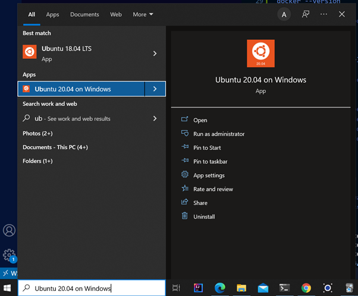
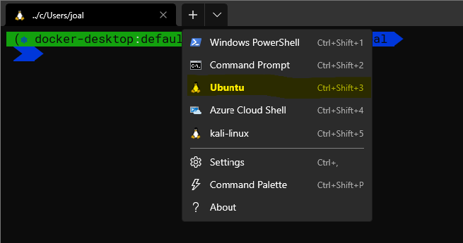

# Notes

# How to prepare your Notebook
This setup is targeted at Zühlke Windows notebook. If you have a different configuration please let us know in advance so we provide you with additional instructions.

## Software
Please install the following software according to the linked resources. A short how-to is provided below.

* Windows Subsystem for Linux (WSL) 
* Ubuntu 20.04 for WSL (recommended, other distributions might work too)
* Docker Desktop
* Helm (in your Linux box)
* Git
* VS Code (or your IDE/text editor of choice)
* Windows Terminal (optional, but very nice)

## Confiugration & Accounts
* Enable WSL integration for Docker Desktop
* Enable local Kubernetes in Docker Desktop
* Login for Docker Hub, if you plan on doing the training in the Zühlke offices (due to IP based pull limits)
* Enable nested virtualization, if running in VM

## Step by step

This is a quick step by step guide on what you should prepare before the course so we can start learning.

If you get stuck or have any questions, do not hesiate to contact us in advance.

### (Enable nested virtualization)

**Only required if running inside a VM**

https://docs.microsoft.com/en-us/virtualization/hyper-v-on-windows/user-guide/nested-virtualization

### Install WSL

https://docs.microsoft.com/en-us/windows/wsl/install

In a shell with admin permissions run
```
wsl --install
```


Ensure you're running WSL 2 and not the legacy WSL 1
```shell
wsl --status
```

Example output
```
Default Distribution: Ubuntu
Default Version: 2

Windows Subsystem for Linux was last updated on 8 Nov 2021
WSL automatic updates are on.

Kernel version: 5.10.60.1
```

### Install Windows Terminal (optional)

See https://docs.microsoft.com/en-us/windows/terminal/install

### Install Ubuntu 20.04 from the Microsoft store

See https://www.microsoft.com/store/productId/9N6SVWS3RX71
Alternative link: https://aka.ms/wslstore

You should now be able to run the Ubuntu app 



or select the shell in the Windows Terminal



On first run you'll be asked to setup a user.

### Install Docker Desktop

**Note:** If you plan on using Docker Desktop commercially, please ensure you sign up to the Zühlke plan by creating an account with your Zühlke mail and contact group IT https://ticket.zuehlke.com/

See https://www.docker.com/products/docker-desktop

### Enable WSL backend in Docker Desktop

**Note:** This is probably already your default if installed after WSL


### Enable WSL integration in Docker Desktop


### Enable Kubernetes in Docker Desktop


### Install Git in Ubuntu
Open a shell into your Ubuntu and run the following command

```shell
sudo apt install -y git
```

### Install Helm in Ubuntu

```shell
curl -fsSL -o get_helm.sh https://raw.githubusercontent.com/helm/helm/main/scripts/get-helm-3
chmod 700 get_helm.sh
./get_helm.sh
```

### Create login for Docker Hub
**Only if you plan on doing the training in the Zühlke offices**
This is due to IP based pull limits imposed on anonymous hub.docker.com access

Go to https://hub.docker.com/signup to signup

Run the following command in your Ubuntu and follow the instructions
```shell
docker login
```

### Verification
To check things are up and running, execute the following command in your Ubuntu. There should be a list of pods in the "kube-system" namespace (We'll get to that :))

```shell
kubectl get pods -A
```

Example output
```
NAMESPACE        NAME                                                              READY   STATUS    RESTARTS          AGE
kube-system      coredns-78fcd69978-2fp9k                                          1/1     Running   2 (10h ago)       7d5h
kube-system      coredns-78fcd69978-4pvsz                                          1/1     Running   2 (10h ago)       7d5h
kube-system      etcd-docker-desktop                                               1/1     Running   2 (10h ago)       7d5h
...
```


## Fallback

* Option 1: https://labs.play-with-k8s.com/ => Login with GitHub or Docker Account required
* Option 2: self-hosted Linux VM 

# Procedure
* Explain, Demo, hands-on (continue to do it.)

# General Ideas
* Nice to have: Prepare a server with exercises. Students can ssh and need to figure out how many containers are running,
* Volunteers can present their solution. 
* Trainers present solutions after exercise  

# Overall technology
* Zoom with breakout session or Teams
* Zuehlke Miro Board

# We provide
* Handout
* Handout exercises
* Git URL?

## Possible videos to show
* Explaining Container (and Kubernetes)  by Kelsey Hightower 7:50 - 10:00 https://www.youtube.com/watch?v=BE77h7dmoQU
* https://thenewstack.io/kubernetes-gets-childrens-book/ and thy YouTube video. Great but 8 minutes. https://www.youtube.com/watch?v=4ht22ReBjno
* CNCF End User: With Kubernetes, the U.S. Department of Defense Is Enabling DevSecOps on F-16s: https://www.youtube.com/watch?v=junocIMbc9U

## Miscellaneous
* Some emoji: https://osxdaily.com/2013/04/08/add-emoji-command-line-bash-prompt/
https://loige.co/random-emoji-in-your-prompt-how-and-why/
* OR ASCII Art: https://askubuntu.com/questions/234678/how-to-show-ascii-art-at-the-top-of-the-terminal-when-its-opened


# Discussed structure form Power Point
Docker Part 1
Why Docker & use cases (local development, in a cluster, etc.), understanding
default commands: docker run (attach & detach mode), docker ps -a, docker stop, docker rm, docker images, docker pull, docker exec, volumes
Run (tag), network, Image (build, Dockerfile),
Docker Part 2:
Compose (e.g. Milan Kafka Example), Docker CMD vs. Entrypoint, Troubleshooting very Important. Scenario with wrong configs and port mismatch, etc.

Kubernetes Part 1
40K feet view: cluster, orchestrator, etc.  declarative model and desired state, yaml, why pods, namespaces & dns (/etc/host für DNS => Jonathan rdp example), network basics, deployments, services (cluterIP, NodePort, LoadBalancer)

Kubernetes Part 2

Crio-, explain persistence, explain secrets (meaning of key vault), config maps, labels selectors & annotations, rolling updates (Explain zero down time deployment  and corresponding business case). Ingress, Explain DB Schema Change. Liveness vs. readiness probe. Examples Jonathan CLI. Connect with kubeconfig

Logging & Monitoring
Docker & Kubernetes Logs, explain difference between metric & logs, (e.g. ingress dashboard), UC from project: email for end customer
HELM 
